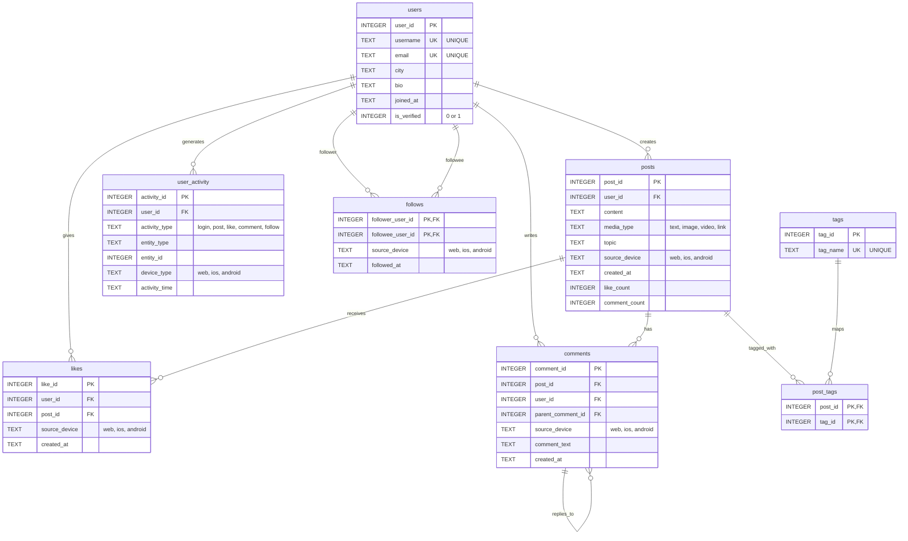

# ER Model (Social Media DBMS)

```mermaid
erDiagram
    users ||--o{ posts : creates
    users ||--o{ likes : gives
    users ||--o{ comments : writes
    users ||--o{ user_activity : generates
    users ||--o{ follows : follower
    users ||--o{ follows : followee

    posts ||--o{ likes : receives
    posts ||--o{ comments : has
    posts ||--o{ post_tags : tagged_with

    tags ||--o{ post_tags : maps
    comments ||--o{ comments : replies_to

    users {
        INTEGER user_id PK
        TEXT username UK "UNIQUE"
        TEXT email UK "UNIQUE"
        TEXT city
        TEXT bio
        TEXT joined_at
        INTEGER is_verified "0 or 1"
    }

    posts {
        INTEGER post_id PK
        INTEGER user_id FK
        TEXT content
        TEXT media_type "text, image, video, link"
        TEXT topic
        TEXT source_device "web, ios, android"
        TEXT created_at
        INTEGER like_count
        INTEGER comment_count
    }

    tags {
        INTEGER tag_id PK
        TEXT tag_name UK "UNIQUE"
    }

    post_tags {
        INTEGER post_id PK,FK
        INTEGER tag_id PK,FK
    }

    follows {
        INTEGER follower_user_id PK,FK
        INTEGER followee_user_id PK,FK
        TEXT source_device "web, ios, android"
        TEXT followed_at
    }

    likes {
        INTEGER like_id PK
        INTEGER user_id FK
        INTEGER post_id FK
        TEXT source_device "web, ios, android"
        TEXT created_at
    }

    comments {
        INTEGER comment_id PK
        INTEGER post_id FK
        INTEGER user_id FK
        INTEGER parent_comment_id FK
        TEXT source_device "web, ios, android"
        TEXT comment_text
        TEXT created_at
    }

    user_activity {
        INTEGER activity_id PK
        INTEGER user_id FK
        TEXT activity_type "login, post, like, comment, follow"
        TEXT entity_type
        INTEGER entity_id
        TEXT device_type "web, ios, android"
        TEXT activity_time
    }
```
